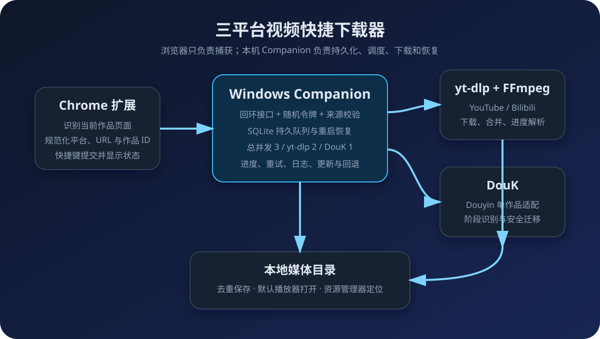
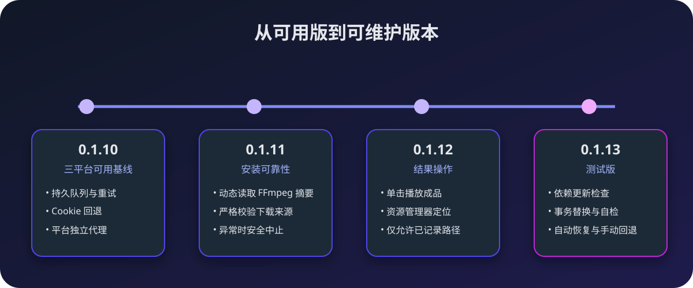

我经常在 YouTube、Bilibili 和 Douyin 之间切换。看到值得保存的视频时，原来的流程通常是复制链接、打开不同的下载工具、选择目录，再回来继续浏览。单次操作不算麻烦，但一天重复很多次以后，真正打断注意力的不是下载速度，而是这些零散步骤。

所以我给自己做了一个 Windows 本地工具：停留在具体作品页时按下 `Ctrl+Shift+Y`，浏览器扩展识别当前平台和作品，把规范化后的链接交给本机 Companion。YouTube 和 Bilibili 由 `yt-dlp` 处理，Douyin 由 DouK 处理；队列、进度、重试和结果都能在扩展面板中查看。

这篇文章记录它从最小原型发展到 0.1.13 测试版的过程。它不是一个在线解析网站，也不会把平台 Cookie 发到远端服务；所有调度和下载都在本机完成。

> 请只下载自己有权保存的内容，并遵守内容平台的服务条款和当地法律。这个项目解决的是本地工作流问题，不用于绕过付费、访问控制或版权限制。

## 我一开始想解决什么

最初目标很简单：在支持的网站按一次快捷键，当前视频就进入下载队列，其他网页则什么都不做。

真正开始制作后，我发现“按键调用下载器”只占很小一部分。一个日常可用的工具还必须处理这些问题：

- 浏览器扩展不能直接可靠地启动本机可执行文件；
- Chrome 的 Manifest V3 后台会休眠，不适合管理长时间下载；
- 三个平台的链接格式、Cookie、代理和下载后端不同；
- 浏览器关闭、扩展重载或程序重启后，任务不能消失；
- 同一个作品不应该被重复下载；
- 依赖会升级，上游下载地址和文件摘要也可能变化；
- 自动更新失败时，必须能恢复旧版本，而不是留下半套程序。

因此最终实现的核心并不是一个快捷键，而是一条边界明确的本地流水线。

## 架构思路：让每一层只做一件事

### 浏览器扩展只负责“捕获”

扩展读取当前激活标签页，判断它是不是支持的作品页面，再提取平台、作品 ID 和规范 URL。当前支持：

- YouTube 普通视频和 Shorts；
- Bilibili 视频、分 P 和番剧页面；
- Douyin 当前激活的视频或图文作品。

站内非作品页和其他网站会被直接忽略。即使扩展已经判断了平台，本机服务仍会重新校验 URL、Host、路径和 ID，不把浏览器传来的分类当作可信输入。

### Companion 才是状态真相

下载可能持续几分钟，而浏览器扩展的弹窗随时会关闭，Manifest V3 的后台也可能休眠。因此任务管理被放进常驻系统托盘的 Windows Companion：

- 使用 SQLite 保存任务、重试次数、进度和最终文件；
- 只有任务成功写入数据库后，才向扩展返回“已接收”；
- 重启后恢复排队中、运行中或重试中的任务；
- 扩展面板每秒读取一次状态，但关闭面板不会影响下载。

默认并发是总任务 3 个、`yt-dlp` 任务 2 个、DouK 任务 1 个。DouK 必须单独限流，因为多个进程会竞争同一套设置、下载记录和工作目录；但 DouK 忙碌时，后面的 YouTube 或 Bilibili 任务仍然可以运行。

### 不强行统一三个平台

YouTube 和 Bilibili 都交给 [`yt-dlp`](https://github.com/yt-dlp/yt-dlp)，音视频合并由 FFmpeg 完成。Douyin 则保留 DouK 的交互与数据结构，再用包装层把单作品下载接入统一队列。

这比写一个“看起来统一”的下载器更务实。统一的是任务模型、状态和操作方式，不统一的是每个平台真正不同的登录、代理和下载实现。

### 本地接口也要有边界

Companion 只监听 `127.0.0.1`，请求还需要随机生成的本机令牌和扩展来源校验。这个令牌只用于保护回环接口，不是平台令牌，也不包含 Cookie。

扩展不能传入任意命令、可执行文件路径或最终输出路径。0.1.12 增加“播放成品”和“在资源管理器中显示”后，本机接口也只接受数据库中已完成任务自己记录的现存文件，不能借这个入口打开任意路径。

## 制作过程中最值得记录的几个坑

### 1. 运行中的 Chrome 会锁住 Cookie 数据库

YouTube 和 Bilibili 的真实日志都出现过 `Could not copy Chrome cookie database`。这不是权限不足，而是 Windows 上运行中的 Chrome 锁住了 Cookie SQLite 文件。

最后采用的策略是：先尝试 Chrome，数据库被锁时回退 Firefox。若公开视频无需登录也能下载，仍可继续；需要登录权益时，则应确保 Firefox 中也登录了相应平台。

### 2. YouTube 和 Bilibili 不应该共用代理

早期配置只有一个 `yt_dlp.proxy`，这会让国内 Bilibili 流量也绕行境外代理，增加延迟，还可能触发地区或出口 IP 风控。

0.1.10 把代理拆成平台独立配置：YouTube 可以使用自己的 SOCKS5 或 HTTP 代理，Bilibili 默认直连。这个改动不显眼，却直接决定了日常稳定性。

### 3. DouK 首次运行不是普通命令行工具

DouK 首次启动需要选择语言并接受第三方免责声明。早期安装器只是解压程序，结果调度器传入的下载链接会被 DouK 当成首次运行菜单输入。

后来的安装流程会先创建工作目录，再打开 DouK 的原生初始化窗口，等待用户自行完成语言和免责声明确认。升级时整个用户数据目录会先被同盘暂存，程序替换后再原样恢复，避免覆盖 Cookie、记录和已有文件。

### 4. 抖音 403 不能只归因于 Cookie

一次真实故障中，新任务和过去成功的对照任务都在获取作品信息时返回 HTTP 403。刷新 Firefox Cookie 后仍然失败，说明问题不只是某条视频或 Cookie 过期。

隔离测试发现，旧 DouK 5.7 在同样的会话和网络下失败，而 5.8 可以成功下载。5.8 更换了请求实现和参数，同时调整了数据目录与菜单。修复不能只替换一个 EXE：包装脚本、目录识别、Cookie 刷新和哈希校验都要一起适配。

### 5. “自动更新”必须和“回退”一起设计

0.1.10 的安装器使用 FFmpeg 的 `latest` 地址，却把构建时的旧哈希固定在脚本里。上游更新资产以后，URL 没变，文件和摘要变了，安装器就会必然失败。

0.1.11 改为从官方 Release API 读取同一资产的当前摘要，同时严格限制仓库、HTTPS 地址、文件名和摘要格式。缺少元数据、来源异常或本地哈希不一致时都会停止安装，而不是跳过校验。

这个经验后来直接影响了 0.1.13：更新不是“覆盖文件”，而是下载到隔离目录、校验、自检、等待现有任务结束、备份旧文件、事务替换；失败自动恢复，用户也能手动回退。

## 版本是怎样一步步长出来的

| 版本 | 主要变化 |
| --- | --- |
| 0.1.1–0.1.9 | 完成托盘 Companion、安装器、SQLite 队列、Cookie 路由、DouK 初始化、Firefox 回退等基础能力。 |
| 0.1.10 | 形成三平台可用基线；平台代理分离，YouTube 可走代理，Bilibili 默认直连。 |
| 0.1.11 | 修复 FFmpeg `latest` 资产变化导致的安装校验失败，改为读取官方 Release 摘要后再验证。 |
| 0.1.12 | 扩展任务卡可直接播放已下载文件，或在资源管理器中定位；调度器升级到 0.7.0。 |
| DouK 5.8 适配 | 修复旧请求实现造成的抖音 403，同时兼容新的 Volume 目录和菜单。 |
| 0.1.13 测试版 | 增加依赖更新检查、选择性安装、跳过版本、事务替换、崩溃恢复和单组件回退。 |

0.1.10 被保留为第一个冻结的可用版本，之后的安装包和源码快照也没有覆盖旧归档。这样出现回归时，可以比较或退回明确的历史状态，而不是依赖“应该还能用”的记忆。

## 现在已经完成的功能

- 一个快捷键捕获 YouTube、Bilibili 和 Douyin 当前作品；
- 工具栏按钮与快捷键使用同一提交逻辑；
- SQLite 持久队列、重启恢复、自动和手动重试；
- 平台级并发限制，三个后端任务可以受控并行；
- `yt-dlp` 百分比、速度和 ETA 展示；
- DouK 的读取、下载、迁移和完成阶段展示；
- 同平台、作品 ID 和分 P 参数的重复抑制；
- YouTube／Bilibili 的 Chrome Cookie 失败后回退 Firefox；
- YouTube／Bilibili 独立代理策略；
- 下载日志、错误摘要和失败重试；
- 单击任务卡播放成品，在资源管理器中选中文件；
- 检查 `yt-dlp`、Deno、FFmpeg／ffprobe 和 DouK 更新；
- 更新前校验来源和 SHA-256，失败恢复及依赖回退；
- 登录 Windows 后自动启动，也可以从托盘启停服务。

在一次隔离回归中，YouTube、Bilibili 和 Douyin 均首次下载成功，并分别通过媒体信息检查。更新功能共有 47 项自动化测试，另外执行了四项真实依赖的下载、校验、安装、自检和回退测试。

这些结果证明的是当时选定样本和环境下的可用性，不意味着平台未来改版后永远不会失效。

## 当前版本怎样使用

### 1. 安装 Companion

运行安装器，选择程序目录和最终视频目录。安装器会从限定的官方来源取得并校验 `yt-dlp`、FFmpeg、Deno 和 DouK。当前安装包没有 Authenticode 签名，因此 Windows 可能显示未知发布者提示。

首次安装 DouK 时，需要在它自己的窗口中选择语言、阅读并确认免责声明。如果 Firefox 已登录 Douyin，还可以按程序提示导入 Cookie。

### 2. 加载 Chrome 扩展

在 `chrome://extensions/` 开启开发者模式，加载项目的 `extension` 文件夹。默认快捷键是 `Ctrl+Shift+Y`，也可以在 `chrome://extensions/shortcuts` 修改。

### 3. 完成一次本机配对

Companion 初次运行会生成随机的本机接口令牌。将令牌填入扩展设置，监听地址使用本机回环地址，然后点击“测试连接”。

令牌不要截图或公开。它只需要在新安装或新浏览器配置中配对一次。

### 4. 设置目录和代理

右键系统托盘中的 Video Download Companion，打开设置：

- 选择 YouTube／Bilibili 成品目录；
- 选择 Douyin 成品目录；
- 为 YouTube 填写需要使用的代理；
- Bilibili 通常保持直连；
- 按需要开启登录后自动启动。

不要把包含账号信息的代理地址写入截图或公开配置示例。

### 5. 一键提交下载

打开具体作品页面，按 `Ctrl+Shift+Y`。扩展面板会显示排队、运行、重试、完成或失败。任务完成后可以直接单击卡片播放，或点击“打开位置”。

若同一作品已经成功完成，再次提交会被去重。若程序重启，未完成任务会恢复到队列，下载器本身继续处理可以续传的临时文件。

### 6. 处理常见故障

- **Chrome Cookie 数据库被锁**：程序会尝试回退 Firefox；需要登录权益时，确认 Firefox 已登录对应平台。
- **Bilibili 返回 HTTP 412**：优先检查 Firefox 登录状态，并确认 Bilibili 没有错误继承 YouTube 的代理。
- **DouK 又出现语言选择**：说明首次初始化没有完成，重新运行 DouK 完成初始化。
- **Douyin 提示 Cookie 未配置**：在 Firefox 登录后，从托盘运行 DouK Cookie 刷新。
- **依赖更新失败**：先保留现有版本，查看日志；不要关闭校验或直接覆盖文件。

## 仍然存在的边界

这个项目当前是为自己的 Windows 环境开发和验证的工具，还不是面向公众的一键发行产品：

- Chrome 扩展仍需手工加载和首次填写连接令牌；
- 安装包尚未签名；
- 0.1.13 是已有安装的测试升级包，不是完整的新机安装器；
- DouK 未验证的新版本只提示，不会自动覆盖；
- 平台接口、登录策略和风控会变化，任何下载器都需要持续维护；
- 视频转写、内容分析、长期归档和兴趣画像不属于当前下载器职责。

最后一条尤其重要。把工具的边界停在“可靠下载”之后，反而让它更容易维护。后续如果增加字幕、Whisper、内容分析或知识库归档，也应该作为独立流水线消费下载结果，而不是继续把所有功能塞进浏览器扩展。

## 这次项目给我的启发

最初我只是想少复制几次链接，最后真正有价值的却是对本地自动化边界的整理：浏览器负责识别和触发，常驻程序负责状态，成熟工具负责平台细节，数据库负责恢复，而更新功能必须同时考虑校验和回退。

很多“按一下就完成”的小工具，背后真正困难的不是第一次跑通，而是第二天还能用、失败后知道发生了什么、升级以后还能退回来。这个三平台下载器的版本演进，本质上就是把一次性的脚本逐步变成一个可解释、可恢复、可继续维护的本地产品。
